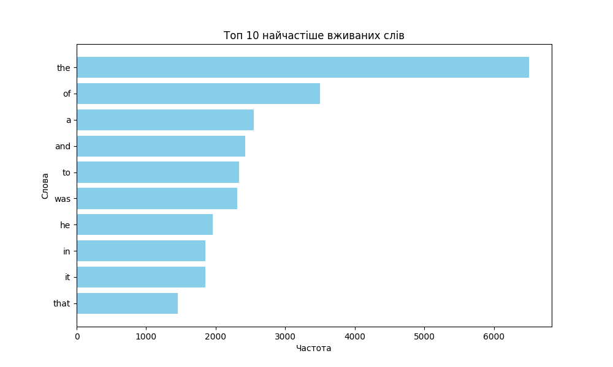

# goit-cs-hw-05

## Activate Virtual Environment

Windows

```powershell
python -m venv .venv
.\.venv\Scripts\Activate.ps1
pip install -r requirements.txt
```

## Завдання 1

Напишіть Python-скрипт, який буде читати всі файли у вказаній користувачем вихідній папці (source folder) і розподіляти їх по підпапках у директорії призначення (output folder) на основі розширення файлів. Скрипт повинен виконувати сортування асинхронно для більш ефективної обробки великої кількості файлів.


### Покрокова інструкція

1. Імпортуйте необхідні асинхронні бібліотеки.
1. Створіть об'єкт `ArgumentParser` для обробки аргументів командного рядка.
1. Додайте необхідні аргументи для визначення вихідної та цільової папок.
1. Ініціалізуйте асинхронні шляхи для вихідної та цільової папок.
1. Напишіть асинхронну функцію `read_folder`, яка рекурсивно читає всі файли у вихідній папці та її підпапках.
1. Напишіть асинхронну функцію `copy_file`, яка копіює кожен файл у відповідну підпапку у цільовій папці на основі його розширення.
1. Налаштуйте логування помилок.
1. Запустіть асинхронну функцію `read_folder` у головному блоці.


### Критерії прийняття

- Код виконує асинхронне читання та копіювання файлів.
- Файли розподілено по підпапках на основі їх розширень.
- Програма обробляє аргументи командного рядка.
- Усі помилки логовано.
- Код читабельний та відповідає стандартам PEP 8.

```bash
> python .\task_1\main.py ".venv" "out"

...
2024-12-17 09:35:37,316 - INFO - Файл .venv\Scripts\Activate.ps1 скопійовано до out\ps1\Activate.ps1
2024-12-17 09:35:37,317 - INFO - Файл .venv\Scripts\pip3.13.exe скопійовано до out\exe\pip3.13.exe
2024-12-17 09:35:37,318 - INFO - Файл .venv\Scripts\pip.exe скопійовано до out\exe\pip.exe
2024-12-17 09:35:37,318 - INFO - Файл .venv\Scripts\pythonw.exe скопійовано до out\exe\pythonw.exe
2024-12-17 09:35:37,319 - INFO - Файл .venv\Scripts\python.exe скопійовано до out\exe\python.exe
2024-12-17 09:35:37,319 - INFO - Файл .venv\Scripts\pip3.exe скопійовано до out\exe\pip3.exe
```

## Завдання 2

Напишіть Python-скрипт, який завантажує текст із заданої URL-адреси, аналізує частоту використання слів у тексті за допомогою парадигми MapReduce і візуалізує топ-слова з найвищою частотою використання у тексті.


### Покрокова інструкція

1. Імпортуйте необхідні модулі (matplotlib та інші).
1. Візьміть код реалізації MapReduce з конспекту.
1. Створіть функцію visualize_top_words для візуалізації результатів.
1. У головному блоці коду отримайте текст за URL, застосуйте MapReduce та візуалізуйте результати.

### Критерії прийняття

- Код завантажує текст із заданої URL-адреси.
- Код виконує аналіз частоти слів із використанням MapReduce.
- Візуалізація відображає топ-слова за частотою використання.
- Код використовує багатопотоковість.
- Код читабельний та відповідає стандартам PEP 8.

### Результат

```bash
> python .\task_2\main.py
```

Результат виконання для поезії Джона Кітса


